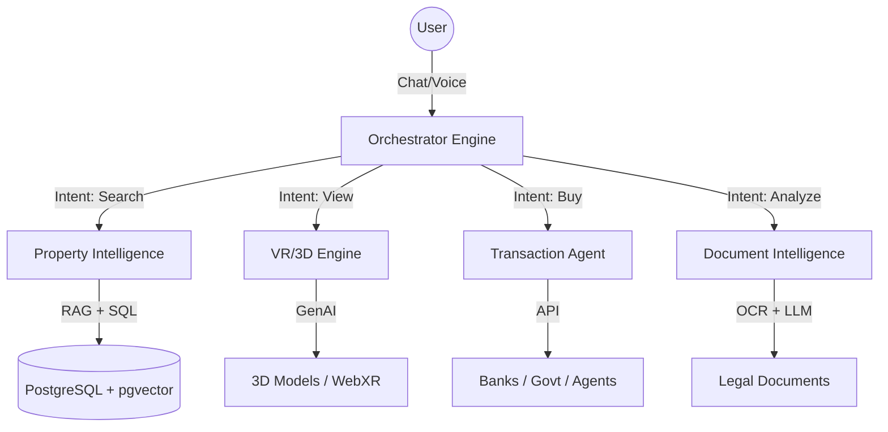

# IKIGAI (生き甲斐)
### Intelligent Knowledge-Integrated Guidance for Automated Investments

> **"A buyer in Japan opens a chat, describes what they want, and the system finds properties, predicts fair prices, simulates renovations in VR, negotiates, handles paperwork, and closes the purchase — with minimal human intervention."**

---

## ⛩️ The Vision

**IKIGAI** is not just another property portal. It is an **Autonomous Real Estate Agent** built for the complexities of the Japanese market.

Breaking away from the fragmented, opaque, and paper-heavy traditions of Japanese real estate, IKIGAI unifies the entire purchase journey—from initial discovery to key handover—into a single, fluent, AI-driven conversation.

It doesn't just *chat*. It **acts**.

---

## 🧠 The Intelligence: Large Action Model (LAM)

Unlike passive chatbots, IKIGAI is built on a **Large Action Model** architecture powered by **LangGraph**. It doesn't just retrieve information; it executes complex workflows with regulatory compliance and precision.



### ⚡ Core Capabilities

-   **🔍 Natural Language Search**: "Find me a pet-friendly 2LDK in Setagaya under ¥80M, built after 2010." The system translates this into complex SQL + Vector queries.
-   **🔮 Price Prediction**: A Gradient-Boosted Machine Learning model (LightGBM) estimates fair market value based on *Rosenka* (road ratings), historical transactions, and 50+ localized features.
-   **🕶️ Generative VR**: Instant conversion of 2D floor plans (*madorizu*) into interactive 3D WebXR environments. "Show me this room with the wall removed" triggers a real-time renovation simulation.
-   **📄 Legal AI**: Automated parsing and risk analysis of *Tokibo Tohon* (Registry) and *Juyo Jiko Setsumeisho* (Important Matters), flagging risks like "non-conforming zoning" or "old earthquake standards."
-   **🤖 Multilingual Fluency**: Native-level Japanese (Keigo/Casual) and context-aware English support, bridging the gap for international investors.

---

## 🏛️ System Architecture

Built as a high-performance **Turborepo** monorepo, designed for scale and developer experience.

| Domain | Technology Stack |
| :--- | :--- |
| **Frontend (Web)** | **Next.js 15** (App Router), Radix UI, Tailwind CSS 4, Framer Motion |
| **Frontend (Mobile)** | **React Native** (Expo SDK 52), NativeWind, Reanimated |
| **AI Orchestration** | **Python 3.12**, **LangGraph**, FastAPI, Anthropic Claude 3.5 Sonnet |
| **Database** | **PostgreSQL 16**, **pgvector**, **Drizzle ORM** |
| **Infrastructure** | **AWS** (EKS, RDS Aurora, S3, ElastiCache), **Terraform** |
| **Design System** | **SUMI (墨)** — Custom design language for Trust & Clarity |

### Repository Structure

```
ikigai/
├── apps/
│   ├── web/              # Buyer-facing Next.js App
│   ├── mobile/           # iOS/Android Expo App
│   ├── admin/            # Internal Admin Dashboard
│   └── line-bot/         # Hono on Cloudflare Workers
├── services/
│   ├── orchestrator/     # AI Agent Brain (Python/LangGraph)
│   ├── pricing-model/    # ML Price Prediction Service
│   ├── vr-engine/        # 3D/WebXR Generation Service
│   └── document-ocr/     # Legal Document Analysis Service
├── packages/
│   ├── db/               # Shared Drizzle Schema & Migrations
│   ├── ui/               # "SUMI" Design System Components
│   ├── ai/               # Shared AI SDK & Prompts
│   └── seed/             # Synthetic Data Generators
└── infrastructure/       # Terraform & Kubernetes Manifests
```

---

## 🚀 Getting Started

Preparation is key. Ensure you have **Docker**, **Node.js 22+**, and **Python 3.12+** installed.

### 1. Bootstrap the Environment

```bash
# Install dependencies (pnpm is mandatory)
pnpm install

# Initialize environment variables
cp .env.example .env
```

### 2. Ignite the Infrastructure

We use Docker Compose for local development to spin up Postgres (with pgvector), Redis, and service emulators.

```bash
# Start databases and core services
pnpm db:up

# Seed the database with synthetic Tokyo property data
pnpm db:seed
```

### 3. Launch the Platform

One command to rule them all.

```bash
# Start all apps (Web, Mobile, Admin) and Services (Orchestrator, Pricing)
pnpm dev
```

-   **Web App**: [http://localhost:3000](http://localhost:3000)
-   **Orchestrator API**: [http://localhost:8000/docs](http://localhost:8000/docs)
-   **Admin Dashboard**: [http://localhost:3002](http://localhost:3002)

---

## ⚖️ Regulatory Compliance

IKIGAI is engineered with **Compliance-by-Design** for the Japanese market.

-   **Audit Trails**: Every AI action is logged in an immutable `action_logs` ledger.
-   **Human-in-the-Loop**: High-stakes actions (Offers, Contracts) require explicit user confirmation and/or licensed professional (`Takken-shi`) review.
-   **Data Sovereignty**: Architecture designed for AWS Tokyo Region (`ap-northeast-1`) data residency.

---

## 🎌 The Philosophy: *Muji* for Real Estate?

Our visual language, **SUMI (墨)**, is inspired by traditional ink wash painting. It prioritizes **Clarity** over noise, **Trust** over conversion tactics, and **Harmony** between human and machine.

> *We don't build tools to replace agents. We build intelligence to empower buyers.*

---

© 2026 IKIGAI Platform. All Rights Reserved.
